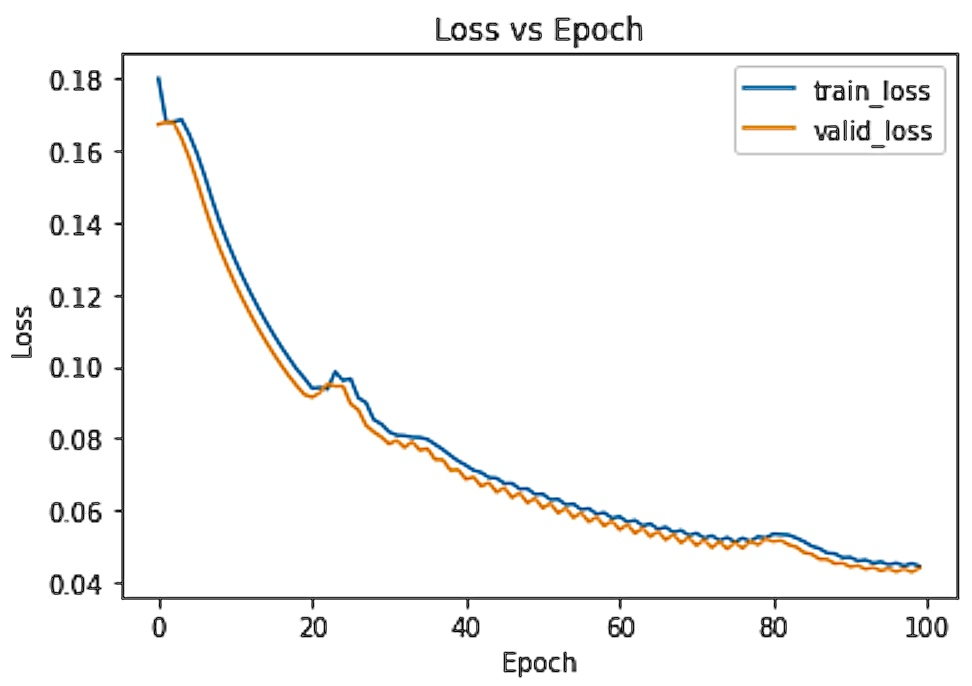

<p align="center">
  
</p>

A trainable two-layer neural network classifier built with [NumPy](https://github.com/numpy/numpy) for educational purposes.

See `usage.ipynb` for an end-to-end example.

## Quickstart

#### 1. Clone
``` bash 
git clone https://github.com/rossheat/numnet
cd numnet
```

#### 2. Create environment
``` bash 
conda env create --name numnet --file=environment.yml
conda activate numnet
```

#### 3. Train
```python
learn = NumNet(in_features=784, hidden_nodes=20, out_classes=10)
recorder = learn.fit(X_train, y_train, epochs=100, lr=0.5, valid_pct=0.1)
```

#### 4. Evaluate training

View loss (MAE) and accuracy
```python
recorder.tail(6)
```

| epoch | train_loss | valid_loss | valid_acc |
|-------|------------|------------|-----------|
| 95    | 0.043772   | 0.043797   | 0.922381  |
| 96    | 0.042275   | 0.043863   | 0.934286  |
| 97    | 0.042492   | 0.042716   | 0.931667  |
| 98    | 0.041664   | 0.042789   | 0.943571  |
| 99    | 0.041433   | 0.041896   | 0.957857  |
| 100   | 0.040433   | 0.040896   | 0.961857  |


Plot training losses
```python
recorder.plot_loss()
```



#### 5. Test

Report accuracy
```python
learn.test(X_test, y_test)
```

#### 6. Predict

Infer labels
```python
learn.predict(X_test)
```

#### 7. Export

Export parameter dictionary
```python
learn.parameters()
```

## License
MIT
